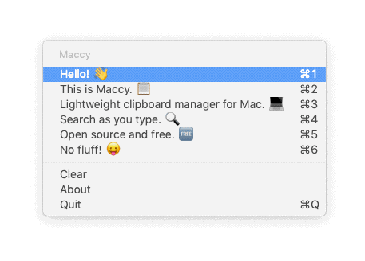

# Maccy.app



## About

Maccy is a simple clipboard manager for macOS. It keeps the history of what you copy
and lets you easily navigate, search and use previous clipboard contents.

There are dozens of similar applications out there, so why build another?
Over the past years since I moved from Linux to macOS, I struggled to find
a clipboard manager that is as free and simple as [Parcellite](http://parcellite.sourceforge.net).
Also, I wanted to learn Swift and get acquainted with macOS application development.

## Features

* open source and free
* lightweight
* uses standard macOS menu
* search-as-you-type

## Install

Download the latest version from the [releases](https://github.com/p0deje/Maccy/releases/latest) page, or use [Homebrew](https://brew.sh/):

```bash
brew cask install maccy
```

## Usage

⌘+⇧+C.

## Customization

### Popup Hotkey

```bash
$ defaults write org.p0deje.Maccy hotKey control+option+m # default is command+shift+c
```

### History Size

```bash
$ defaults write org.p0deje.Maccy historySize 100 # default is 999
```

### Show/Hide Icon in Status Bar

```bash
defaults write org.p0deje.Maccy showInStatusBar false # default is true
```

### Automatically Start at Login

Just add Maccy to your "Login items".

## CI

[](https://travis-ci.org/p0deje/Maccy)

## License

[MIT](./LICENSE)
